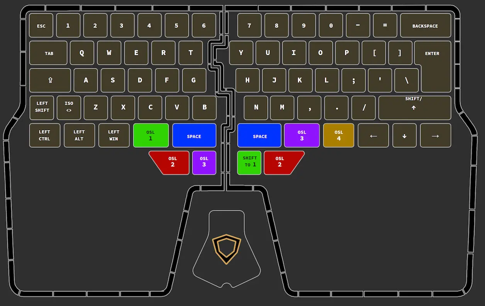
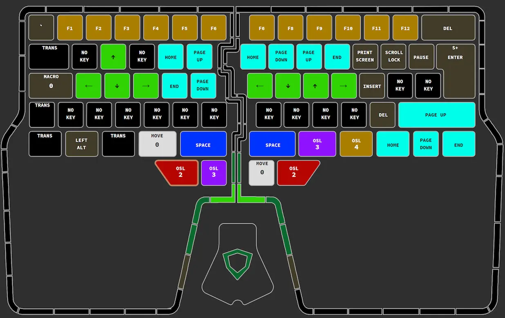
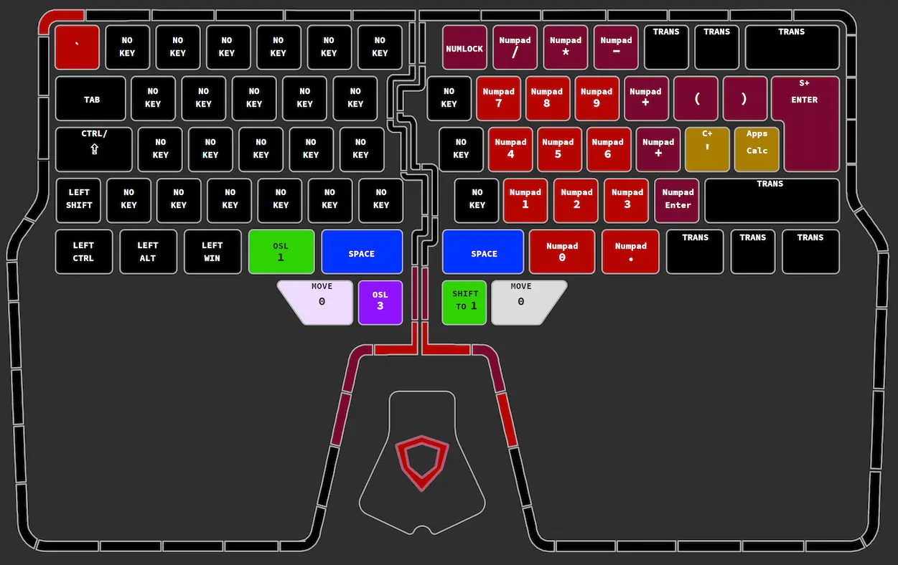
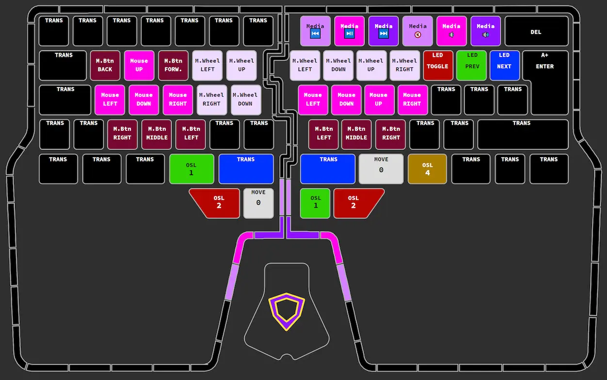
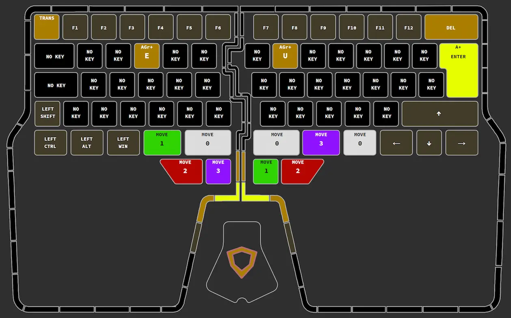

# Dygma Raise Keymap

A backup of my keymap and macros for my Dygma Raise.

## Links

- [Bazecor key remapper](https://dygma.com/pages/programmable-split-keyboard)
- [Bazecor source](https://github.com/Dygmalab/Bazecor)
- [Dygma Raise firmware](https://github.com/Dygmalab/Raise-Firmware)

## Layer 0 - Base

Standard ISO QWERTY layout, with arrow keys replacing the right modifier keys,
except for right shift which is <kbd>Up Arrow</kbd> on press and
<kbd>Shift</kbd> on hold. The innermost thumb keys are mapped to space, with the
others being mapped to one-shots of each layer, in a layout that is consistent
between layers.

## Layer 1 - Navigation

On the left, <kbd>WASD</kbd> are mapped to the arrow keys, and <kbd>RFTG</kbd>
are mapped to <kbd>Home</kbd>, <kbd>End</kbd>, <kbd>PageUp</kbd> and
<kbd>PageDown</kbd> respectively, which is the same layout relative to each
other that they are in on a standard keyboard.

On the right, the <kbd>HJKL</kbd> keys are bound to the arrow keys with the Vim
layout. The row above is mapped to <kbd>Home</kbd>, <kbd>PageDown</kbd>,
<kbd>PageUp</kbd> and<kbd>End</kbd> so that each extended cursor movement is
positioned one above its regular movement. The keys which are bound to arrow
keys in Layer 0 are bound to <kbd>Home</kbd>, <kbd>End</kbd>, <kbd>PageUp</kbd>,
<kbd>PageDown</kbd> on Layer 1, to provide the same effect when shifting between
layers 0 and 1.

Number keys are equivalent F key. <kbd>`</kbd> is bound to <kbd>Esc</kbd>
because I couldn't think of anywhere else to squeeze it in.

CapsLock on layer 1 is bound to the only macro, which toggles the keyboard
between UK English to Russian layout and toggles the on-screen keyboard so that
I can find the Cyrillic keys.

## Layer 2 - Numpad

Layer 2 maps the numpad to the right hand side of the keyboard in a layout that
is as close as possible to a regular numpad. In addition to this, the
<kbd>()</kbd> keys are mapped to the same position as <kbd>[]{}</kbd> so all the
matched brackets can be typed on the same keys with different modifiers.
<kbd>'</kbd> is mapped to
<kbd>Ctrl + '</kbd> to make it easier to open the Terminal in VSCode one handed.

## Layer 3 - Mouse & Media

Keys for mouse movement, mouse wheel and left, middle and right click. This is
mostly useful for making it easier to select and drag with the touchpad, and
makes it possible to right and middle drag. The layout of the mouse movement
buttons matches the arrow key layouts on the navigation layer. Also puts the
media keys in a similar position to where they were on my old keyboard, and has
the keys for changing backlight settings.

## Layer 4 - Layer Lock

Since the <kbd>AltGr</kbd> key isn't used for much, I've bound it to a layer
shift too, and added keybinds with <kbd>AltGr</kbd> to the only keys that I know
that actually use that modifier. The F keys are bound to functions as this was
the layer I'd originally planned to have the function keys bound on, before
realising there was space on layer 1.

The most useful thing about this layer is it rebinds the other layer shifting
keys from one-shot lock/shift to move to the layer, so this layer works as a
layer lock for the next layer that you move to. When locked to a layer, the key
which normally shifts to the current layer is rebound to move back to layer 0.
